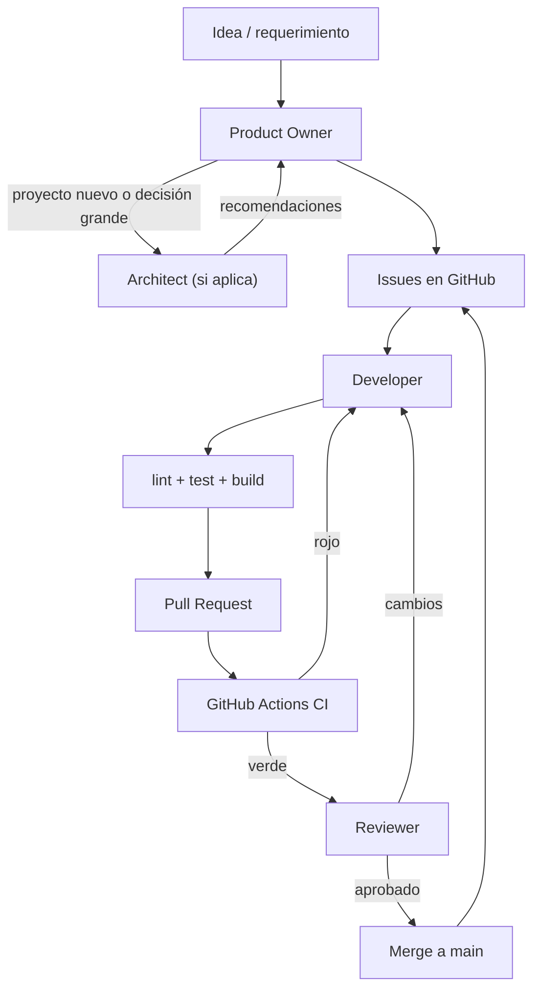

# Agent Workflow

Define cuándo actúa cada agente del equipo, cómo se encadenan y qué dispara
cada transición. Es agnóstico al proyecto.

## Equipo de agentes

| Agente | Tipo | Rol |
|--------|------|-----|
| Product Owner | Ejecución | Crea y prioriza Issues |
| Architect | Asesoría | Decisiones de diseño e infraestructura |
| DevOps | Asesoría | CI/CD, deploy, infra, recomendaciones |
| Developer | Ejecución | Implementa Issues hasta PR |
| Reviewer | Gate | Revisa PRs antes del merge |

**No hay agentes separados de Security ni QA.** Sus responsabilidades están
embebidas en estándares + Reviewer + CI.

## Flujo completo

## Triggers: cuándo actúa cada agente

### Product Owner

| Trigger | Acción |
|---------|--------|
| Nueva idea o requerimiento | Crear/actualizar Issues |
| Backlog desordenado | Reordenar labels `order-NN` |
| Issue completado (cerrado) | Verificar que el siguiente esté desbloqueado |

**Invocación:** manual — `@agents/product-owner/prompt.md`

### Architect

| Trigger | Acción |
|---------|--------|
| Proyecto nuevo (antes del scaffold) | Recomendar estructura de módulos, stack |
| Issue de fundación (#8 scaffold) | Validar estructura propuesta |
| Decisión no obvia (ORM, patrón async) | Asesorar, documentar ADR |
| PR con cambio estructural cross-cutting | Revisar impacto arquitectónico |

**Invocación:** manual — `@agents/architect/prompt.md`
**No corre automáticamente en cada issue.** Se invoca en los triggers de arriba.

### DevOps

| Trigger | Acción |
|---------|--------|
| Issue de CI (#10) | Implementar workflow de GitHub Actions |
| Necesidad de deploy/staging | Recomendar estrategia |
| Problema de infra en PR/CI | Diagnosticar y recomendar fix |
| Proyecto nuevo | Recomendar setup Docker, CI, env management |

**Invocación:** manual — `@agents/devops/prompt.md`
**En issues de CI**, el Developer implementa siguiendo recomendaciones de
DevOps (el DevOps puede ser invocado antes para asesorar).

### Developer

| Trigger | Acción |
|---------|--------|
| Issue con `order-NN` disponible y dependencias cerradas | Tomar issue, implementar |
| Reviewer pide cambios | Corregir y re-push |

**Invocación:** manual — `@agents/developer/prompt.md`
**Selección automática de issue:** algoritmo en `issue-workflow.md`.

### Reviewer

| Trigger | Acción |
|---------|--------|
| PR abierto hacia `main` | Revisar código, criterios, seguridad |
| CI verde en el PR | Proceder con review |
| CI rojo | Devolver al Developer (no revisar hasta CI verde) |

**Invocación:** manual — `@agents/reviewer/prompt.md`
**Trigger futuro automático:** Cursor Automation o GitHub webhook que invoque
al Reviewer cuando se abre un PR (requiere configuración externa).

## Security y QA sin agente dedicado

| Responsabilidad | Dónde vive |
|-----------------|------------|
| Reglas de seguridad | `standards/security-standards.md` |
| Tests y quality gate | `standards/testing-standards.md` + CI |
| Review de seguridad en PR | Reviewer (skill `review-security`) |
| Review de bugs en PR | Reviewer (skill `review-bugbot`) |
| Validación de criterios de aceptación | Reviewer (checklist del Issue) |

### Por qué no hay QA Agent separado

En una empresa real, QA existe. En nuestro flujo automatizado:

1. **Developer** escribe tests (estándar).
2. **CI** ejecuta tests en cada PR (gate automático).
3. **Reviewer** valida criterios de aceptación del Issue.

Agregar un QA Agent separado duplicaría lo que CI + Reviewer ya hacen. Si en
el futuro se necesitan tests E2E complejos o exploración manual, se puede
agregar un QA Agent. Por ahora, no aporta valor incremental.

### Por qué no hay Security Agent separado

Security es transversal, no un paso del pipeline. Las reglas viven en el
estándar; el Reviewer las aplica en cada PR con la skill `review-security`.
Un Security Agent dedicado tendría sentido con auditorías periódicas o
compliance formal — overkill para MVP.

## Automatización futura

Para que los agentes actúen sin invocación manual:

| Agente | Mecanismo posible |
|--------|-------------------|
| Developer | Cursor Automation: cron que invoque developer prompt |
| Reviewer | GitHub webhook → Cursor Automation on PR opened |
| DevOps | Alertas de CI fallido → invocar DevOps |
| Architect | Invocación manual (decisiones puntuales) |

Esto requiere [Cursor Automations](https://cursor.com) o integración custom.
Por ahora, la invocación es manual vía `@agents/<rol>/prompt.md`.

## Dónde vive cada cosa

| Qué | Dónde |
|-----|-------|
| Flujo de agentes (este archivo) | `ai-software-company/standards/agent-workflow.md` |
| Prompts de agentes | `ai-software-company/agents/<rol>/prompt.md` |
| Skills de review | Cursor skills: `review-bugbot`, `review-security` |
