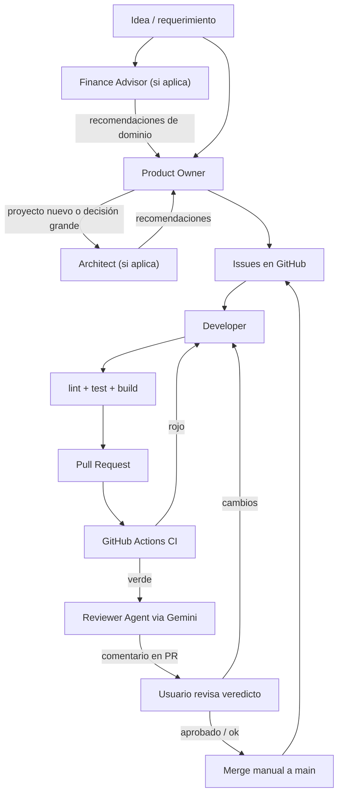

# Agent Workflow

Define cuándo actúa cada agente del equipo, cómo se encadenan y qué dispara
cada transición. Es agnóstico al proyecto.

## Equipo de agentes

| Agente | Tipo | Rol |
|--------|------|-----|
| Product Owner | Ejecución | Crea y prioriza Issues |
| Architect | Asesoría | Decisiones de diseño e infraestructura |
| Finance Advisor | Asesoría | Criterio de dominio: alertas, features de research, priorización inversor |
| DevOps | Asesoría | CI/CD, deploy, infra, recomendaciones |
| Developer | Ejecución | Implementa Issues hasta PR |
| Reviewer | Gate | Revisa PRs antes del merge |

**No hay agentes separados de Security ni QA.** Sus responsabilidades están
embebidas en estándares + Reviewer + CI.

## Flujo completo

## Triggers: cuándo actúa cada agente

### Product Owner

| Trigger | Acción |
|---------|--------|
| Nueva idea o requerimiento | Crear/actualizar Issues |
| Backlog desordenado | Reordenar labels `order-NN` |
| Issue completado (cerrado) | Verificar que el siguiente esté desbloqueado |

**Invocación:** `/po` (slash command) o `@agents/product-owner/prompt.md`

### Finance Advisor

| Trigger | Acción |
|---------|--------|
| Consulta sobre features de research / alertas | Recomendar qué agregar, cambiar o descartar |
| Revisión de reglas de relevancia | Decir cuándo alertar vs no |
| Priorización de ideas de producto financiero | Opinar valor para inversor retail |
| Idea de trading / señales buy-sell | Acotar o rechazar si choca con la visión |

**Invocación:** `/fin` o `@agents/finance-advisor/prompt.md`
**No crea Issues ni código.** Si el outcome es backlog, el usuario invoca `/po`.
**Disclaimer:** criterio de diseño de producto, no asesoramiento financiero.

### Architect

| Trigger | Acción |
|---------|--------|
| Proyecto nuevo (antes del scaffold) | Recomendar estructura de módulos, stack |
| Issue de fundación (#8 scaffold) | Validar estructura propuesta |
| Decisión no obvia (ORM, patrón async) | Asesorar, documentar ADR |
| PR con cambio estructural cross-cutting | Revisar impacto arquitectónico |

**Invocación:** `/arch` o `@agents/architect/prompt.md`
**No corre automáticamente en cada issue.** Se invoca en los triggers de arriba.

### DevOps

| Trigger | Acción |
|---------|--------|
| Issue de CI | Implementar workflow de GitHub Actions |
| Issue de AI Review (`ai-review.yml`) | Asesorar espera de CI, secrets, permisos |
| Necesidad de deploy/staging | Recomendar estrategia |
| Problema de infra en PR/CI | Diagnosticar y recomendar fix |
| Proyecto nuevo | Recomendar setup Docker, CI, env management |

**Invocación:** `/ops` o `@agents/devops/prompt.md`
**En issues de CI / AI Review**, el Developer implementa siguiendo recomendaciones
de DevOps (el DevOps puede ser invocado antes para asesorar).

### Developer

| Trigger | Acción |
|---------|--------|
| Issue con `order-NN` disponible y dependencias cerradas | Tomar issue, implementar |
| Reviewer pide cambios | Corregir y re-push |

**Invocación:** `/dev` (ej. `/dev siguiente`, `/dev 8`) o `@agents/developer/prompt.md`
**Selección automática de issue:** algoritmo en `issue-workflow.md`.

### Reviewer

| Trigger | Acción |
|---------|--------|
| Invocación manual en Cursor (`/rev`) | **Camino por defecto** — review + comentario en el PR (opcionalmente Bugbot / Security) |
| PR abierto/actualizado hacia `main` + `AI_REVIEW_ENABLED=true` | Workflow `ai-review.yml` (GitHub Actions) |
| CI verde en el PR (solo si automático on) | Proceder con review vía Gemini API |
| CI rojo o `AI_REVIEW_ENABLED` ≠ `true` | No revisar en Actions (skip) |

**Invocación manual (default):** `/rev` (ej. `/rev 12`, `/rev siguiente`) o
`@agents/reviewer/prompt.md` en Cursor. Puede usar skills Bugbot / Security
Review. El veredicto se publica como **comentario en el PR** (no solo en el
chat de Cursor).

**Invocación automática (opt-in):** GitHub Actions + Gemini
(`GEMINI_API_KEY_REVIEWER`), usando el prompt en `agents/reviewer/prompt.md`
(o la copia en el repo de producto). Requiere variable de repo
`AI_REVIEW_ENABLED=true`. Si está apagada o ausente, el job se skipea.
**Sin auto-merge:** el usuario lee el veredicto y mergea a mano.

## Security y QA sin agente dedicado

| Responsabilidad | Dónde vive |
|-----------------|------------|
| Reglas de seguridad | `standards/security-standards.md` |
| Tests y quality gate | `standards/testing-standards.md` + CI |
| Review de seguridad en PR | Reviewer automático (checklist) + opcional skill `review-security` en Cursor |
| Review de bugs en PR | Opcional skill `review-bugbot` en Cursor |
| Validación de criterios de aceptación | Reviewer (checklist del Issue) |

### Por qué no hay QA Agent separado

En una empresa real, QA existe. En nuestro flujo automatizado:

1. **Developer** escribe tests (estándar).
2. **CI** ejecuta tests en cada PR (gate automático).
3. **Reviewer** valida criterios de aceptación del Issue.

Agregar un QA Agent separado duplicaría lo que CI + Reviewer ya hacen. Si en
el futuro se necesitan tests E2E complejos o exploración manual, se puede
agregar un QA Agent. Por ahora, no aporta valor incremental.

### Por qué no hay Security Agent separado

Security es transversal, no un paso del pipeline. Las reglas viven en el
estándar; el Reviewer las aplica en cada PR. Un Security Agent dedicado tendría
sentido con auditorías periódicas o compliance formal — overkill para MVP.

## API keys de Gemini (separación de cupos)

El free tier de Gemini es por proyecto. Usar **dos proyectos** distintos:

| Secret / variable | Uso |
|-------------------|-----|
| `GEMINI_API_KEY_REVIEWER` | Solo CI / Reviewer Agent (`ai-review.yml`) |
| `GEMINI_API_KEY_FINANCE` | Solo producto (análisis de noticias, etc.) |

No compartir la misma key entre Reviewer y producto.

## Automatización

| Agente | Mecanismo |
|--------|-----------|
| Reviewer | Default: `/rev` en Cursor. Opt-in: `ai-review.yml` + `AI_REVIEW_ENABLED=true` → Gemini |
| Developer | Manual vía `@agents/developer/prompt.md` (futuro: Cursor Automation) |
| DevOps | Manual; alertas de CI fallido pueden invocarlo |
| Architect | Invocación manual (decisiones puntuales) |
| Finance Advisor | Invocación manual (`/fin`) para dominio / alertas / features |

## Dónde vive cada cosa

| Qué | Dónde |
|-----|-------|
| Flujo de agentes (este archivo) | `ai-software-company/standards/agent-workflow.md` |
| Prompts de agentes | `ai-software-company/agents/<rol>/prompt.md` |
| Slash commands (atajos) | `ai-software-company/.cursor/commands/` y `templates/cursor/commands/` |
| Skills de review (Cursor, opcionales) | Cursor skills: `review-bugbot`, `review-security` |
| Workflow de review automático | `<product-repo>/.github/workflows/ai-review.yml` |
